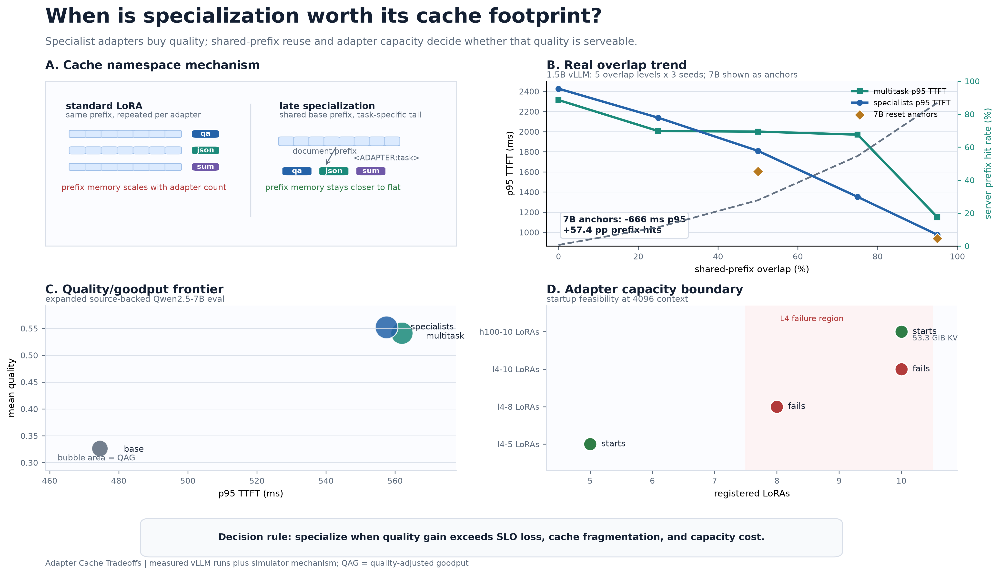

# Adapter Cache Tradeoffs

Specialist adapters improve quality, but every routing decision is also a cache
decision.

This repository benchmarks when adapter/model specialization is worth its
KV-cache footprint under shared-prefix serving workloads. It compares semantic
routing, cache-aware routing, sticky routing, multitask adapters, standard
LoRA-style cache fragmentation, and activated-LoRA-style late specialization.

## Current Result

The latest real run is a streamed vLLM sweep:

| Result | Value |
| --- | ---: |
| Real streamed vLLM requests | 7,520 |
| Exhaustive sweep runs | 112 |
| Specialist quality at c8 | 0.848 |
| Specialist p95 TTFT at c8 | 878.9 ms |
| Specialist QAG at c8 | 7.300 |
| Multitask quality at c8 | 0.703 |
| Multitask p95 TTFT at c8 | 874.1 ms |
| Multitask QAG at c8 | 6.023 |

Specialists won the repeated-seed held-out frontier at concurrency 8. The
controlled-overlap sweep shows why cache locality is the hinge: specialist QAG
rose from `0.031` at 0% shared prefix to `1.377` at 95% shared prefix, while
p95 TTFT fell from `2426.9ms` to `975.4ms`.

Read the full run snapshot in [docs/real_eval_results.md](docs/real_eval_results.md).
Selected plots are committed in [docs/figures](docs/figures/).



## Research Question

When is model/adapter specialization worth its KV-cache footprint?

The thesis:

- Specialist adapters can improve task quality.
- Standard LoRA-style serving can fragment prefix-cache reuse because adapter
  identity is often part of the cache namespace.
- A serving system should jointly optimize quality, cache locality, latency
  SLOs, memory footprint, and tenant isolation.

## Why Semantic Routing Is Not Enough

Semantic routing sends QA to a QA adapter, JSON extraction to a JSON adapter,
and code/documentation tasks to a code adapter. That is locally sensible.

The problem is that repeated shared prefixes can be cached once per adapter
instead of once per trust group. In document-heavy workloads, a naive specialist
router can turn one reusable prefix into several adapter-specific cache copies.

This benchmark makes that tradeoff measurable.

## Cache Models

| Cache model | What it represents |
| --- | --- |
| `standard_lora` | Adapter identity is part of the prefix-cache key. |
| `base_shared` | Optimistic shared-base cache baseline. |
| `activated_lora` | Tokens before the adapter invocation marker can be shared. |
| `copy_on_write` | Shared base prefix plus adapter-specific deltas in the simulator. |

## Quickstart

```bash
uv sync --extra dev
make check
make small
```

The default path runs on CPU and does not require a GPU or model server.

Each run writes:

| Artifact | Purpose |
| --- | --- |
| `requests.jsonl` | Per-request prompt, routing, response, quality, and latency log. |
| `summary.json` | Aggregate quality, cache, latency, SLO, and goodput metrics. |
| `config_resolved.yaml` | Fully resolved config for reproducibility. |
| `manifest.json` | Run metadata, git metadata, and artifact list. |

Generated raw artifacts are ignored by git under `artifacts/runs/`.
Regenerate the main whitepaper figure with:

```bash
make whitepaper-figure
```

## Mock vs Real Backends

Use the mock backend for deterministic systems experiments:

```bash
make small
make matrix
uv run python -m adapter_cache_bench.bench.run_matrix \
  --config configs/benchmark/memory_pressure.yaml
uv run python -m adapter_cache_bench.bench.run_matrix \
  --config configs/benchmark/repeated.yaml
```

Use JSONL eval configs when you need task records with ground truth:

```bash
make validate-eval-large
make validate-source-eval
make source-eval
uv run python -m adapter_cache_bench.bench.run_workload \
  --config configs/benchmark/public_domain_eval_large.yaml
```

Use vLLM or another OpenAI-compatible local server when you need real model
outputs:

```bash
make vllm-source-eval
make vllm-source-eval-lora-qwen
uv run python -m adapter_cache_bench.bench.run_concurrent \
  --config configs/benchmark/heldout_xlarge_sft_eval_vllm_lora_trained_qwen15b_concurrent.yaml
```

The vLLM path expects served adapter model names such as `qa-lora`,
`json-lora`, `summary-lora`, `code-lora`, and `multitask-lora`.

## Reproduce The Main Sweep

Start vLLM with the trained adapters, then run:

```bash
make vllm-exhaustive-all
```

For cleaner per-condition server cache metrics, configure the reset hook
described in [docs/vllm.md](docs/vllm.md). It restarts the server, waits for
health, scrapes `/metrics`, runs the benchmark, and records metric deltas.

## Stronger Eval And Multi-Model Work

The included JSONL fixtures are engineering fixtures, not paper-grade external
evals. The next research pass should replace them with independently curated
data and repeat the same sweeps across model families.

```bash
make validate-external-eval
make vllm-external-eval
make vllm-model-family
```

See [docs/external_eval.md](docs/external_eval.md) for schema and provenance
requirements.

## Workloads

| Workload | Purpose |
| --- | --- |
| `shared_doc_qa` | Many questions over the same long document. |
| `mixed_tasks_same_doc` | QA, JSON, summarization, and code/doc tasks over one document. |
| `agent_session` | Multi-turn sessions with growing history and repeated tool traces. |
| `low_overlap_control` | Random prompts with little shared prefix. |
| `prompt_layout_ablation` | Instruction-before-document vs document-before-instruction. |
| `controlled_overlap` | Explicitly sweeps shared-prefix overlap from low to high. |
| `jsonl_eval` | File-backed records for real or source-backed evaluation. |

## Router Policies

| Router | Behavior |
| --- | --- |
| `random` | Baseline random traffic spread. |
| `semantic` | Route by task type to the expected specialist. |
| `multitask` | Route every task to a shared multitask adapter. |
| `sticky_session` | Keep a session on the same adapter when compatible. |
| `cache_aware` | Combine quality prior, cached-token estimate, queue, session, isolation, and cold penalties. |
| `oracle` | Simulator upper bound using known ground truth and backend quality. |

## Important Docs

| Document | Contents |
| --- | --- |
| [docs/real_eval_results.md](docs/real_eval_results.md) | Real vLLM run results and interpretation. |
| [docs/large_model_results.md](docs/large_model_results.md) | Real 7B vLLM cache/SLO pilot result. |
| [docs/vllm.md](docs/vllm.md) | vLLM/OpenAI-compatible serving flow. |
| [docs/external_eval.md](docs/external_eval.md) | How to plug in stronger external evals. |
| [docs/research_plan.md](docs/research_plan.md) | Next research steps and acceptance criteria. |
| [docs/eval_datasets.md](docs/eval_datasets.md) | JSONL eval schema. |
| [docs/model_backends.md](docs/model_backends.md) | Backend options. |
| [docs/gcloud_vllm.md](docs/gcloud_vllm.md) | GCP L4 runbook. |
| [docs/large_model_benchmarking.md](docs/large_model_benchmarking.md) | 7B/14B/70B-class benchmark plan. |
| [docs/release_checklist.md](docs/release_checklist.md) | Public release checklist. |

## Repo Structure

```text
configs/                         benchmark, router, cache, and workload YAMLs
data/eval/                       small public-domain-style JSONL fixtures
docs/                            runbooks, results, and public figures
src/adapter_cache_bench/cache/   whitespace tokenizer and prefix-cache simulators
src/adapter_cache_bench/routing/ router policies
src/adapter_cache_bench/backends/mock, local Transformers, and vLLM clients
src/adapter_cache_bench/bench/   workload, matrix, sweep, and metrics runners
src/adapter_cache_bench/analysis/reporting, plots, SLO, and Pareto helpers
```

The Python import path remains `adapter_cache_bench`.

## Verification

```bash
uv run pytest tests -q
uv run ruff check .
uv run ruff format . --check
```

GPU and model-server tests are optional and skipped unless explicitly enabled.

## Limitations

- Whitespace tokenization approximates prefix blocks; it does not match a real
  serving tokenizer.
- Mock quality is deterministic systems scaffolding, not model evaluation.
- Cache memory accounting is token-based, not byte-accurate KV allocation.
- `activated_lora` and `copy_on_write` are simulators, not vLLM kernel
  implementations.
- vLLM prefix-cache metrics are server-level counters. Adapter-aware per-cache
  namespace counters still require serving-layer instrumentation.
- The included eval fixtures are intentionally small and public-domain style.
  Replace them before making broader research claims.

## Physical AI Analogue

The same cache-specialization problem appears in VLA serving. Text prefix tokens
map to repeated visual/proprioceptive scene tokens; KV cache maps to a
world-state cache; LoRA adapters map to skill or embodiment adapters; TTFT and
goodput map to control latency and success-rate-adjusted control Hz.

See
[src/adapter_cache_bench/physical_ai_analogue/README.md](src/adapter_cache_bench/physical_ai_analogue/README.md).

## License

MIT. See [LICENSE](LICENSE).
