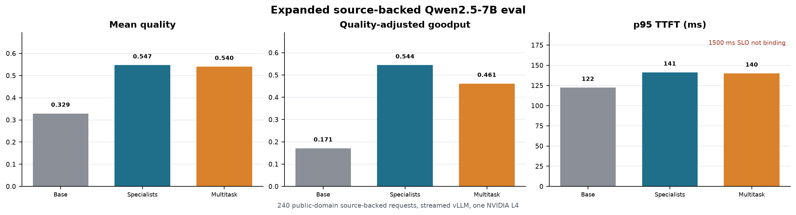

# Adapter Cache Tradeoffs: When Is Specialization Worth Its KV-Cache Footprint?

A reproducible benchmark for quality, prefix-cache locality, latency SLOs, and
adapter capacity in causal-transformer serving.

## Thesis

Adapter specialization is not a pure model-quality decision. In causal
transformer serving, it is a joint systems decision across task quality,
prefix-cache locality, latency SLOs, adapter capacity, and tenant isolation.

The project's central question is:

> When is adapter specialization worth its KV-cache footprint?

The current evidence supports a conditional answer: specialist adapters can buy
quality, but the quality is worth serving only when the gain exceeds the SLO
loss, cache fragmentation, memory footprint, and operational cost introduced by
specialization.

## Why This Exists

Adapter routing is often framed semantically: send QA prompts to a QA adapter,
JSON extraction prompts to a JSON adapter, and summarization prompts to a
summary adapter. That is locally sensible, but it can be globally expensive. If
adapter identity participates in the prefix-cache namespace, then the same long
document prefix may be cached repeatedly for multiple adapters rather than
shared once.

This repo turns that hidden serving tradeoff into a measured frontier. It
compares base models, specialist LoRAs, multitask LoRAs, cache-aware routing,
sticky routing, standard LoRA-style cache accounting, and late-specialization
simulators under shared-prefix workloads.

## What We Ran

The experiments were selected to answer one question at a time rather than to
produce a single broad benchmark number.

| Experiment family | Why it was run | What it can support |
| --- | --- | --- |
| CPU/mock regime suite | Stress routing and cache policies across controlled workload structures without GPU cost. | Simulator-backed claims about workload-dependent policy regret. |
| 1.5B vLLM sweeps | Check whether strategy frontiers appear on a real OpenAI-compatible serving path. | Real-serving evidence that quality, TTFT, cache reuse, and QAG move together. |
| 7B trained-adapter evals | Test whether specialist quality gains survive on a larger causal transformer and real LoRA serving. | Conditional evidence that specialization can beat base and multitask on included fixtures. |
| Reset-isolated overlap sweep | Remove cache-state leakage between overlap conditions and isolate shared-prefix effects. | Strongest current evidence that cache locality is a first-order serving variable. |
| Adapter-capacity probes | Determine whether registered adapters change serving feasibility under fixed GPU/context constraints. | Direct evidence that adapter count belongs in the capacity frontier. |
| Source-backed model-family sweep | Move beyond generated-only fixtures and test two small model families. | Cross-family evidence for the tradeoff, not universal claims. |

The design intentionally avoids starting with a large leaderboard-style
benchmark. The first scientific risk was not "which adapter scores best?" but
"can we measure whether an adapter score is cheap enough to serve?"

## Findings

### 1. Specialist LoRAs Can Buy Quality, But The Serving Objective Is Conditional

On the expanded source-backed Qwen2.5-7B eval, specialist LoRAs improved quality
relative to the base model and slightly beat the multitask LoRA.

| Condition | Requests | Mean quality | QAG | Server prefix hit rate |
| --- | ---: | ---: | ---: | ---: |
| Base | 240 | 0.329 | 0.171 | 55.0% |
| Specialist LoRAs | 240 | 0.547 | 0.544 | 47.9% |
| Multitask LoRA | 240 | 0.540 | 0.461 | 55.0% |

The quality direction repeated on the H100 capacity run, where ten LoRAs could
remain registered at 4096 context. Specialists again beat base and multitask on
the expanded source-backed workload, while server-level prefix-hit rate remained
lower for specialist routing than for base or multitask.

Hypothesis: specialists win when the task-quality delta is large and cache/SLO
cost is moderate; multitask adapters win when the quality delta is small or when
one shared adapter namespace materially improves cache reuse and capacity.

### 2. Cache Locality Changes The Feasible Serving Region

The cleanest systems result is the reset-isolated Qwen2.5-7B vLLM overlap sweep
on one NVIDIA L4. vLLM was restarted before every condition, so server
prefix-cache state could not leak across overlap levels.

| Condition | Runs | Requests | Server prefix hit rate | Mean p95 TTFT | SLO attainment | QAG |
| --- | ---: | ---: | ---: | ---: | ---: | ---: |
| 50% overlap | 5 | 200 | 26.4% | 1603.7 ms | 90.0% | 0.080 |
| 95% overlap | 5 | 200 | 83.8% | 937.7 ms | 100.0% | 0.130 |

High-overlap prompts improved mean p95 TTFT by `666.0 ms`, reduced p95 TTFT by
`41.5%`, lifted SLO attainment by `10.0` percentage points, increased request
throughput by `33.6%`, and raised quality-adjusted goodput by `62.3%`.

Hypothesis: workload-structure metrics such as shared-prefix reuse, adapter
switch rate, and reuse distance should predict when specialization is likely to
be serveable before an expensive GPU run is launched.

### 3. Adapter Count Is A Capacity Variable

The capacity probe showed that adapter registration itself changes serving
feasibility for Qwen2.5-7B at 4096 context.

| GPU | Registered LoRAs | Result |
| --- | ---: | --- |
| NVIDIA L4 24GB | 5 | Starts |
| NVIDIA L4 24GB | 8 | Fails: only 0.09 GiB available KV cache |
| NVIDIA L4 24GB | 10 | Fails: no available memory for cache blocks |
| NVIDIA H100 80GB | 10 | Starts with 53.34 GiB available KV cache |

Hypothesis: practical adapter serving needs capacity frontiers over context
length, adapter count, adapter rank, GPU memory, memory utilization, and tenant
isolation. The number of adapters is not just a model-management parameter; it
is part of the serving budget.

### 4. The Frontier Moves Under Concurrency And SLO Pressure

The 1.5B streaming frontier showed that the best strategy depends on the SLO
objective. Specialists were higher quality across the tested concurrency range,
but multitask was the only tested point under a strict 1s p95 TTFT target at
concurrency 8.

| Strategy | Concurrency | Quality | p95 TTFT | SLO attainment | QAG |
| --- | ---: | ---: | ---: | ---: | ---: |
| Specialists | 8 | 0.847 | 1197.3 ms | 84.0% | 5.254 |
| Multitask | 8 | 0.706 | 962.1 ms | 97.0% | 5.517 |
| Base | 8 | 0.150 | 1029.9 ms | 90.0% | 0.771 |

Hypothesis: a routing policy should not optimize quality alone. It should expose
a Pareto frontier over quality, TTFT, SLO attainment, cache hit rate, and
adapter capacity, then choose based on the deployment's explicit objective.

### 5. Prompt Layout Is A Cache Locality Lever

The prompt-layout ablation found that putting the shared document before the
instruction preserved roughly `190-199` cached prompt tokens in the benchmark
cache model, while instruction-before-document preserved only about `6-7`.

Hypothesis: document-first prompt layouts and late adapter invocation can
preserve shared-prefix locality, but production claims require a serving stack
whose cache-key and kernel behavior actually support that mechanism.

### 6. The Tradeoff Reproduces Across Two Small Model Families

The model-family sweep served Qwen2.5-1.5B and TinyLlama-1.1B through vLLM with
specialist and multitask LoRAs trained from the same source-backed split.
Specialists improved mean quality in both families, but multitask remained
competitive or better on QAG because it used one adapter slot.

| Family | Strategy | Requests | Runs | Quality | p95 TTFT | QAG |
| --- | --- | ---: | ---: | ---: | ---: | ---: |
| Qwen2.5-1.5B | Specialists | 1,500 | 3 | 0.532 | 108.2 ms | 12.164 |
| Qwen2.5-1.5B | Multitask | 1,500 | 3 | 0.460 | 111.9 ms | 12.654 |
| TinyLlama-1.1B | Specialists | 1,500 | 3 | 0.383 | 77.5 ms | 6.026 |
| TinyLlama-1.1B | Multitask | 1,500 | 3 | 0.366 | 97.4 ms | 10.290 |

Hypothesis: the qualitative tradeoff generalizes more robustly than any single
policy winner. The next family-level question is not "do specialists always
win?" but "which workload and hardware regimes make the specialist quality
delta worth the cache and capacity cost?"

## Why Not Other Experiments First

The project deliberately deferred some obvious experiments.

| Deferred experiment | Why it was deferred |
| --- | --- |
| Broad public benchmark leaderboard | The measurement substrate needed to be credible before adding broader quality claims. |
| Many model families | Cloud quota, adapter training time, and attribution discipline made two-family evidence the safer first expansion. |
| Production traffic traces | Real traces require privacy review and normalization before they can support public claims. |
| Activated-LoRA kernel validation | The current `activated_lora` and `copy_on_write` mechanisms are benchmark simulators, not vLLM kernel results. |
| Dollar and power frontier | Cost curves need repeated controlled cloud runs with stable instance pricing and utilization accounting. |
| Recommendation CLI | Recommendations are premature until mock regime metrics are calibrated against reset-isolated real-serving measurements. |

## Methodology Limits

The current evidence is useful, but bounded.

- The source-backed eval fixtures are license-clear and reproducible, but they
  are not standard public causal-transformer benchmarks.
- Generated held-out fixtures are controlled quality probes, not broad model
  evaluation.
- Whitespace tokenization and simulated cache models approximate serving
  mechanisms; they are not byte-accurate KV-cache accounting.
- vLLM exposes server-level prefix-cache counters, not adapter-aware per-request
  cache namespace counters.
- Reset-isolated real-serving results are strongest for the measured
  Qwen2.5-7B/L4 setup; broader GPU and model-family claims need more runs.
- `activated_lora` and `copy_on_write` are mechanism models until validated in
  a serving stack with corresponding cache-key behavior.
- QAG is a practical comparison metric, not a substitute for human evaluation or
  standardized task scoring.

## Research Direction

The next credible step is a bridge from simulator regime science to
reset-isolated real serving.

1. Use the CPU/mock regime suite to identify claim-critical workload structures:
   uniform, Zipfian, bursty, phase-shifted, and adversarial.
2. Select a small number of high-regret or policy-flipping regimes.
3. Reproduce those regimes through the vLLM bridge with server resets, explicit
   cache settings, and repeated seeds.
4. Record the same structure metrics in both mock and real-serving summaries.
5. Compare policy regret, TTFT, cache-hit rate, memory footprint, and QAG.

If the bridge holds, the project can move toward a traffic profiler that tells a
serving team whether its workload is specialization-friendly before it pays for
full GPU sweeps.

## Short-Term Actionables

| Priority | Action | Exit criterion |
| ---: | --- | --- |
| 1 | Keep the public concept note, claim ladder, and README aligned. | A reader can tell what is proven, what is not, and where to start. |
| 2 | Generate a public evidence bundle for the current strongest artifacts. | Bundle manifest includes selected docs, tables, figures, hashes, and git metadata. |
| 3 | Run a reset-isolated vLLM bridge over the claim-critical mock regimes. | Real-serving summaries include matching structure metrics and server counters. |
| 4 | Add a standard public benchmark fixture or adapter-compatible external eval. | Quality claims no longer rely only on generated and source-backed local fixtures. |
| 5 | Expand the capacity frontier. | Context length, adapter count, rank, GPU type, and memory utilization are tabulated. |

## Positioning

The professional story is not that this repo proves specialist adapters are
always better. The stronger story is that it builds the measurement discipline
needed to decide when specialization is worth serving.

Best one-sentence description:

> `adapter-cache-tradeoffs` is a benchmark harness for deciding when adapter
> specialization is worth its KV-cache, SLO, and capacity cost in
> causal-transformer serving.
