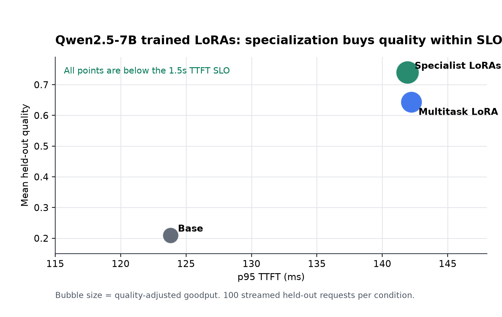
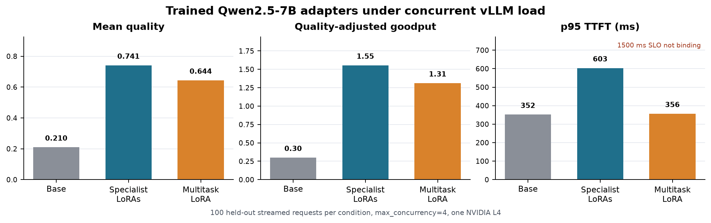
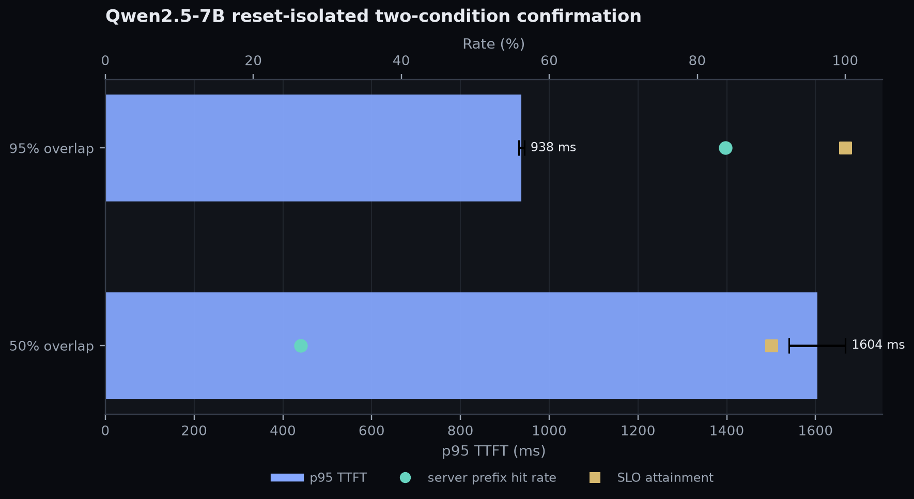

# Large-model vLLM results

Date: 2026-06-15

This page records real vLLM serving runs for a larger base model. It now covers
both sides of the thesis:

- prefix-cache locality for a 7B base causal transformer;
- trained specialist and multitask LoRA adapters served through vLLM.

Serving stack:

- GCP `g2-standard-8` with one NVIDIA L4.
- vLLM OpenAI-compatible server, `vllm/vllm-openai:latest`, vLLM `0.23.0`.
- Model: `Qwen/Qwen2.5-7B-Instruct`.
- Context: `max_model_len=4096`.
- Workload: `controlled_overlap`.
- Cache model in benchmark: `activated_lora`.
- Streaming TTFT enabled.
- SLO: `ttft_slo_ms=1500`.

Run command:

```bash
make vllm-large-model-pilot
```

Confidence sweep command:

```bash
make vllm-large-model-confidence-reset
```

## Trained 7B adapter eval

The quality-side run trained real Qwen2.5-7B LoRA adapters on the generated
public-domain-style SFT split and served them through vLLM as OpenAI-compatible
model names:

- specialists: `qa-lora`, `json-lora`, `summary-lora`, `code-lora`;
- multitask: `multitask-lora`;
- training: 4-bit LoRA, rank 8, alpha 16, max length 768;
- specialist steps: 40 each;
- multitask steps: 80;
- hardware: GCP `g2-standard-8` with one NVIDIA L4 in `asia-south1-b`;
- eval: `artifacts/sft/public_domain_xlarge/eval_requests.jsonl`;
- requests: 100 streamed held-out requests per condition.



| condition | requests | p50 TTFT ms | p95 TTFT ms | p95 E2E ms | SLO attainment | req/s | mean quality | QAG | adapter distribution |
| --- | ---: | ---: | ---: | ---: | ---: | ---: | ---: | ---: | --- |
| base | 100 | 121.0 | 123.8 | 3688.1 | 1.000 | 0.394 | 0.210 | 0.083 | specialists ids, base model |
| specialist LoRAs | 100 | 136.7 | 141.9 | 4067.5 | 1.000 | 0.641 | 0.740 | 0.474 | `summary=21`, `json=27`, `qa=31`, `code=21` |
| multitask LoRA | 100 | 137.4 | 142.2 | 4087.5 | 1.000 | 0.580 | 0.644 | 0.373 | `multitask=100` |

Interpretation:

- The trained specialist adapters improved held-out quality by `3.53x` over the
  base model (`0.740` vs `0.210`) while staying far under the `1500 ms` TTFT SLO.
- The specialist adapters also beat the multitask adapter on quality (`0.740`
  vs `0.644`) and quality-adjusted goodput (`0.474` vs `0.373`).
- In this held-out fixture, the adapter quality gain is large enough that the
  small TTFT cost relative to the base (`+18.1 ms` p95) is clearly worth it.
- This does not remove the cache-footprint concern. It says that under this
  high-reuse, low-concurrency held-out setting, specialization is on the
  favorable side of the frontier. The overlap confidence sweep below shows when
  cache locality becomes the deciding systems variable.

## Concurrent trained 7B adapter eval

The follow-up run used the same trained Qwen2.5-7B base, specialist LoRAs, and
multitask LoRA with `backend.max_concurrency=4`. This checks whether the
quality-side result survives real concurrent serving pressure rather than only a
single-request-at-a-time path.



| condition | requests | p50 TTFT ms | p95 TTFT ms | p99 TTFT ms | p95 E2E ms | SLO attainment | req/s | mean quality | QAG | cached ratio |
| --- | ---: | ---: | ---: | ---: | ---: | ---: | ---: | ---: | ---: | ---: |
| base | 100 | 258.5 | 351.7 | 837.5 | 3970.5 | 1.000 | 1.426 | 0.210 | 0.299 | 0.307 |
| specialist LoRAs | 100 | 290.7 | 603.3 | 809.3 | 4638.9 | 1.000 | 2.097 | 0.741 | 1.554 | 0.309 |
| multitask LoRA | 100 | 312.4 | 356.4 | 366.6 | 4340.8 | 1.000 | 2.038 | 0.644 | 1.312 | 0.307 |

Interpretation:

- Specialist LoRAs retained the best quality under concurrent load: `0.741`
  versus `0.644` for multitask and `0.210` for the base model.
- Specialist LoRAs also had the best quality-adjusted goodput: `1.554`, which
  is `5.19x` the base model and `18.4%` above multitask.
- The serving cost is visible but still within this run's SLO envelope:
  specialist p95 TTFT was `603.3 ms`, versus `351.7 ms` for base and
  `356.4 ms` for multitask, all below the `1500 ms` TTFT SLO.
- This moves the claim from "specialization can win in a quiet eval" to
  "specialization can still win under moderate concurrent vLLM load." The next
  evidence gap is repeated trained-adapter seeds and a non-generated external
  eval set.

## Five-seed isolated confidence sweep

The stronger result uses five seeds and restarts vLLM before every condition so
prefix-cache state cannot leak across overlap levels. Each condition serves 40
streamed requests at concurrency 4, for 400 total requests.



| overlap | runs | requests | p50 TTFT mean ms | p95 TTFT mean ms | p95 TTFT std ms | p99 TTFT mean ms | p95 E2E mean ms | SLO attainment mean | req/s mean | quality mean | QAG mean | cached ratio mean | server prefix hit mean | memory tokens mean |
| ---: | ---: | ---: | ---: | ---: | ---: | ---: | ---: | ---: | ---: | ---: | ---: | ---: | ---: | ---: |
| 0.50 | 5 | 200 | 1515.5 | 2429.7 | 103.0 | 2544.1 | 4454.6 | 0.465 | 1.081 | 0.067 | 0.034 | 0.408 | 0.264 | 4346 |
| 0.95 | 5 | 200 | 924.4 | 1725.2 | 37.6 | 1762.2 | 3693.3 | 0.900 | 1.363 | 0.073 | 0.090 | 0.778 | 0.838 | 1466 |

High-overlap prompts improved p95 TTFT by `704.5 ms` on average, a `29.0%`
reduction. SLO attainment rose from `46.5%` to `90.0%`, request throughput rose
by `26.0%`, and quality-adjusted goodput rose by `163.8%`.

Interpretation:

- This validates the large-base serving side of the thesis: for a 7B causal
  transformer on one L4, shared-prefix locality can move a workload from
  partially SLO-violating to mostly SLO-compliant.
- The server prefix-cache hit rate tracks the benchmark-side cache model:
  `26.4%` at 50% overlap versus `83.8%` at 95% overlap.
- The low-overlap condition also has a larger simulated memory-token footprint
  because fewer shared blocks are reused in the activated-late-specialization
  cache model.
- Combined with the trained-adapter eval above, this gives both halves of the
  first large-model claim: specialization can buy quality, and cache locality
  decides whether that quality comes with acceptable serving behavior.

## Two-condition pilot

The corrected pilot used two controlled-overlap conditions at concurrency 4:

| overlap | requests | p50 TTFT ms | p95 TTFT ms | p95 E2E ms | SLO attainment | req/s | quality | QAG | benchmark cached ratio | server prefix hit rate | memory tokens |
| ---: | ---: | ---: | ---: | ---: | ---: | ---: | ---: | ---: | ---: | ---: | ---: |
| 0.50 | 40 | 1506.7 | 2524.2 | 4528.8 | 0.500 | 1.088 | 0.068 | 0.037 | 0.408 | 0.264 | 4346 |
| 0.95 | 40 | 1008.8 | 1153.2 | 3135.9 | 1.000 | 1.377 | 0.074 | 0.102 | 0.778 | 0.848 | 1466 |

Interpretation:

- High shared-prefix overlap made the 7B run SLO-feasible in this pilot:
  p95 TTFT dropped from `2524.2 ms` at 50% overlap to `1153.2 ms` at 95%
  overlap.
- Server prefix-cache hit rate rose from `26.4%` to `84.8%`.
- Benchmark cached prompt-token ratio rose from `40.8%` to `77.8%`.
- Quality is not the conclusion here because this was a base-only systems run.
  The value is the scaling signal: larger causal transformers make prefix-cache
  locality materially more important to TTFT and goodput.

Notes:

- A separate 7B JSONL serving smoke also completed, but it should not be used as
  an overlap ablation because `jsonl_eval` does not consume
  `shared_prefix_fraction`. The controlled-overlap rows above are the relevant
  large-model cache/SLO evidence.
- The concurrent trained-adapter run above addresses the serving-load part of
  the next-step evidence. Remaining gaps are repeated trained-adapter seeds,
  external/non-generated eval data, and publication of the exact adapter
  checkpoints or a deterministic retraining script.
