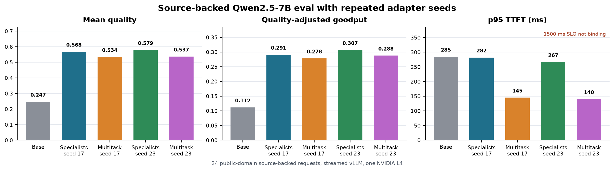

# Large-model vLLM results

Date: 2026-06-15

This page records real vLLM serving runs for a larger base model. It now covers
both sides of the thesis:

- prefix-cache locality for a 7B base causal transformer;
- trained specialist and multitask LoRA adapters served through vLLM.

Serving stack:

- GCP `g2-standard-8` with one NVIDIA L4.
- vLLM OpenAI-compatible server, `vllm/vllm-openai:latest`, vLLM `0.23.0`.
- Model: `Qwen/Qwen2.5-7B-Instruct`.
- Context: `max_model_len=4096`.
- Workload: `controlled_overlap`.
- Cache model in benchmark: `activated_lora`.
- Streaming TTFT enabled.
- SLO: `ttft_slo_ms=1500`.

Run command:

```bash
make vllm-large-model-pilot
```

Confidence sweep command:

```bash
make vllm-large-model-confidence-reset
```

## Trained 7B adapter eval

The quality-side run trained real Qwen2.5-7B LoRA adapters on the generated
public-domain-style SFT split and served them through vLLM as OpenAI-compatible
model names:

- specialists: `qa-lora`, `json-lora`, `summary-lora`, `code-lora`;
- multitask: `multitask-lora`;
- training: 4-bit LoRA, rank 8, alpha 16, max length 768;
- specialist steps: 40 each;
- multitask steps: 80;
- hardware: GCP `g2-standard-8` with one NVIDIA L4 in `asia-south1-b`;
- eval: `artifacts/sft/public_domain_xlarge/eval_requests.jsonl`;
- requests: 100 streamed held-out requests per condition.


| condition | requests | p50 TTFT ms | p95 TTFT ms | p95 E2E ms | SLO attainment | req/s | mean quality | QAG | adapter distribution |
| --- | ---: | ---: | ---: | ---: | ---: | ---: | ---: | ---: | --- |
| base | 100 | 121.0 | 123.8 | 3688.1 | 1.000 | 0.394 | 0.210 | 0.083 | specialists ids, base model |
| specialist LoRAs | 100 | 136.7 | 141.9 | 4067.5 | 1.000 | 0.641 | 0.740 | 0.474 | `summary=21`, `json=27`, `qa=31`, `code=21` |
| multitask LoRA | 100 | 137.4 | 142.2 | 4087.5 | 1.000 | 0.580 | 0.644 | 0.373 | `multitask=100` |

Interpretation:

- The trained specialist adapters improved held-out quality by `3.53x` over the
  base model (`0.740` vs `0.210`) while staying far under the `1500 ms` TTFT SLO.
- The specialist adapters also beat the multitask adapter on quality (`0.740`
  vs `0.644`) and quality-adjusted goodput (`0.474` vs `0.373`).
- In this held-out fixture, the adapter quality gain is large enough that the
  small TTFT cost relative to the base (`+18.1 ms` p95) is clearly worth it.
- This does not remove the cache-footprint concern. It says that under this
  high-reuse, low-concurrency held-out setting, specialization is on the
  favorable side of the frontier. The overlap confidence sweep below shows when
  cache locality becomes the deciding systems variable.

## Concurrent trained 7B adapter eval

The follow-up run used the same trained Qwen2.5-7B base, specialist LoRAs, and
multitask LoRA with `backend.max_concurrency=4`. This checks whether the
quality-side result survives real concurrent serving pressure rather than only a
single-request-at-a-time path.


| condition | requests | p50 TTFT ms | p95 TTFT ms | p99 TTFT ms | p95 E2E ms | SLO attainment | req/s | mean quality | QAG | cached ratio |
| --- | ---: | ---: | ---: | ---: | ---: | ---: | ---: | ---: | ---: | ---: |
| base | 100 | 258.5 | 351.7 | 837.5 | 3970.5 | 1.000 | 1.426 | 0.210 | 0.299 | 0.307 |
| specialist LoRAs | 100 | 290.7 | 603.3 | 809.3 | 4638.9 | 1.000 | 2.097 | 0.741 | 1.554 | 0.309 |
| multitask LoRA | 100 | 312.4 | 356.4 | 366.6 | 4340.8 | 1.000 | 2.038 | 0.644 | 1.312 | 0.307 |

Interpretation:

- Specialist LoRAs retained the best quality under concurrent load: `0.741`
  versus `0.644` for multitask and `0.210` for the base model.
- Specialist LoRAs also had the best quality-adjusted goodput: `1.554`, which
  is `5.19x` the base model and `18.4%` above multitask.
- The serving cost is visible but still within this run's SLO envelope:
  specialist p95 TTFT was `603.3 ms`, versus `351.7 ms` for base and
  `356.4 ms` for multitask, all below the `1500 ms` TTFT SLO.
- This moves the claim from "specialization can win in a quiet eval" to
  "specialization can still win under moderate concurrent vLLM load." The next
  evidence gap is repeated trained-adapter seeds and a non-generated external
  eval set.

## Source-backed eval with repeated adapter seeds

The next check moves off the generated held-out fixture and onto source-backed
public-domain bundles:

- `data/eval/source_eval.jsonl`: 24 hand-authored public-domain source records;
- `data/eval/source_eval_expanded.jsonl`: 240 records from 15 public-domain
  source snippets, balanced across QA, JSON extraction, summarization, code
  checks, and both prompt layouts.

This is still not a full external benchmark, but it is a stronger
non-generated sanity check. It also adds two more Qwen2.5-7B training seeds
(`TRAIN_SEED=23` and `TRAIN_SEED=31`) for the specialist and multitask LoRA
recipes.

The additional adapters were trained with the same short 4-bit LoRA protocol as
the first seed:

- specialists: 40 steps each;
- multitask: 80 steps;
- rank 8, alpha 16, max length 768;
- GCP `g2-standard-8` with one NVIDIA L4.



| condition | requests | p50 TTFT ms | p95 TTFT ms | p99 TTFT ms | p95 E2E ms | SLO attainment | req/s | mean quality | QAG |
| --- | ---: | ---: | ---: | ---: | ---: | ---: | ---: | ---: | ---: |
| base | 24 | 120.7 | 284.8 | 1286.4 | 3681.1 | 1.000 | 0.452 | 0.247 | 0.112 |
| specialist LoRAs, seed 17 | 24 | 137.0 | 282.1 | 1033.6 | 4067.5 | 1.000 | 0.512 | 0.568 | 0.291 |
| multitask LoRA, seed 17 | 24 | 136.4 | 145.2 | 177.1 | 4084.3 | 1.000 | 0.521 | 0.534 | 0.278 |
| specialist LoRAs, seed 23 | 24 | 137.2 | 266.5 | 1099.9 | 4081.8 | 1.000 | 0.530 | 0.579 | 0.307 |
| multitask LoRA, seed 23 | 24 | 135.5 | 140.3 | 176.3 | 4085.6 | 1.000 | 0.536 | 0.537 | 0.288 |
| specialist LoRAs, seed 31 | 24 | 135.8 | 407.4 | 1128.1 | 4077.1 | 1.000 | 0.523 | 0.574 | 0.300 |
| multitask LoRA, seed 31 | 24 | 135.9 | 139.9 | 182.0 | 4088.5 | 1.000 | 0.507 | 0.568 | 0.288 |


| condition | requests | p50 TTFT ms | p95 TTFT ms | p99 TTFT ms | p95 E2E ms | SLO attainment | req/s | mean quality | QAG | server prefix hit rate |
| --- | ---: | ---: | ---: | ---: | ---: | ---: | ---: | ---: | ---: | ---: |
| base | 240 | 120.3 | 122.3 | 124.9 | 3685.2 | 1.000 | 0.521 | 0.329 | 0.171 | 0.550 |
| specialist LoRAs | 240 | 135.8 | 141.2 | 145.8 | 2131.4 | 1.000 | 0.995 | 0.547 | 0.544 | 0.479 |
| multitask LoRA | 240 | 135.5 | 140.0 | 186.5 | 2757.5 | 1.000 | 0.854 | 0.540 | 0.461 | 0.550 |

Interpretation:

- The source-backed eval confirms the direction of the generated held-out
  result, but at a smaller effect size: on the 24-row set, specialists improve
  quality from `0.247` to `0.568-0.579`, about `2.3x` over base.
- Specialists beat multitask on all three training seeds on quality and QAG.
  The seed-31 quality margin is small (`0.574` vs `0.568`), which is the right
  cautionary signal for a small eval.
- The 240-row expanded source-backed run preserves the direction: specialists
  reach `0.547` quality and `0.544` QAG versus base `0.329` / `0.171` and
  multitask `0.540` / `0.461`.
- TTFT is not the bottleneck in these source-backed runs. All conditions are
  below the `1500 ms` TTFT SLO. The tradeoff is more visible in memory and
  capacity than in p95 TTFT for this specific workload.
- vLLM cache attribution remains run-level, not per request. The benchmark
  records per-request simulated cached-token estimates, while vLLM exposes
  server-level Prometheus counters such as `vllm:prefix_cache_hits_total` and
  `vllm:prefix_cache_queries_total`. The expanded run shows server prefix hit
  rates of `55.0%` for base/multitask and `47.9%` for specialists.

## Adapter capacity on one L4

The serving-capacity probe used the trained Qwen2.5-7B adapters on one
`g2-standard-8` L4, `max_model_len=4096`, `gpu_memory_utilization=0.85`, and
vLLM `0.23.0`.

The structured capacity records live in
[data/results/capacity_frontier.yaml](../data/results/capacity_frontier.yaml)
and can be exported with `make capacity-frontier`.

| registered LoRAs | contents | result |
| ---: | --- | --- |
| 5 | one specialist seed plus multitask | starts successfully |
| 8 | two specialist seeds | fails before serving |
| 10 | two specialist seeds plus two multitask adapters | fails before serving |

The eight-LoRA failure reported:

```text
To serve at least one request with the model's max seq len (4096), 0.22 GiB KV cache is needed, which is larger than the available KV cache memory (0.09 GiB). Based on the available memory, the estimated maximum model length is 1664.
```

The ten-LoRA failure reported no available memory for cache blocks. This is a
direct systems result: adding adapter registrations can consume enough serving
headroom that the server cannot reserve KV cache for even one max-length
request.

## H100 spot capacity confirmation

A follow-up run used the same trained Qwen2.5-7B adapters on a GCP
`a3-highgpu-1g` spot VM with one NVIDIA H100 80GB HBM3 in `us-central1-c`.
Standard 2x L4, A100 80GB, and all-regions GPU quota requests were denied, but
`PREEMPTIBLE-NVIDIA-H100-GPUS-per-project-region` was approved to one GPU.

The H100 VM used `ubuntu-accelerator-2204-amd64-with-nvidia-580`, vLLM
`0.23.0`, `max_model_len=4096`, `gpu_memory_utilization=0.90`, prefix caching,
and ten rank-8 LoRA registrations:

- seed-17/default: `qa-lora`, `json-lora`, `summary-lora`, `code-lora`,
  `multitask-lora`;
- seed-23: `seed23-qa-lora`, `seed23-json-lora`, `seed23-summary-lora`,
  `seed23-code-lora`, `seed23-multitask-lora`.

vLLM loaded all ten LoRAs successfully. The startup log reported:

- available KV cache memory: `53.34 GiB`;
- GPU KV cache size: `998,768` tokens;
- maximum concurrency for 4096-token requests: `243.84x`.

This directly closes the one-L4 capacity question: the same 4096-context
10-LoRA registration pattern that failed on one L4 starts successfully on one
H100 80GB.

The same expanded source-backed workload was then run against the 10-LoRA-loaded
H100 server:

| condition | run id | requests | p95 TTFT ms | mean quality | QAG | server prefix hit rate |
| --- | --- | ---: | ---: | ---: | ---: | ---: |
| base | `source-eval-expanded-vllm-qwen7b-1781558787102` | 240 | 474.5 | 0.326 | 0.503 | 0.550 |
| specialist LoRAs | `source-eval-expanded-vllm-lora-trained-qwen7b-1781558622688` | 240 | 557.5 | 0.552 | 0.964 | 0.500 |
| multitask LoRA | `source-eval-expanded-vllm-lora-multitask-qwen7b-1781558968104` | 240 | 561.9 | 0.541 | 0.921 | 0.550 |

Interpretation:

- This is primarily a capacity result, not a clean L4-versus-H100 latency
  comparison. The H100 server kept ten LoRAs resident while the earlier L4
  expanded eval used the smaller feasible LoRA set.
- The quality direction still matches the L4 expanded eval: specialists beat
  base and multitask on the source-backed workload.
- The cache-fragmentation pattern remains visible at the server counter level:
  specialist routing has a lower prefix-hit rate than base/multitask because
  adapter identity is part of the effective cache namespace.
- The practical frontier is now clearer: one L4 is enough for a small
  specialist-plus-multitask deployment, but not enough for broader multi-seed or
  many-tenant adapter registration at 4096 context. One H100 80GB has ample KV
  headroom for that shape.

## Five-seed isolated confidence sweep

The stronger result uses five seeds and restarts vLLM before every condition so
prefix-cache state cannot leak across overlap levels. Each condition serves 40
streamed requests at concurrency 4, for 400 total requests.

The table below is the June 16, 2026 rerun on `adapter-cache-vllm-l4-run` in
`asia-south1-b`.


| overlap | runs | requests | p50 TTFT mean ms | p95 TTFT mean ms | p95 TTFT std ms | p99 TTFT mean ms | p95 E2E mean ms | SLO attainment mean | req/s mean | quality mean | QAG mean | cached ratio mean | server prefix hit mean | memory tokens mean |
| ---: | ---: | ---: | ---: | ---: | ---: | ---: | ---: | ---: | ---: | ---: | ---: | ---: | ---: | ---: |
| 0.50 | 5 | 200 | 923.5 | 1603.7 | 63.2 | 1774.3 | 3775.6 | 0.900 | 1.310 | 0.068 | 0.080 | 0.408 | 0.264 | 4346 |
| 0.95 | 5 | 200 | 355.7 | 937.7 | 5.9 | 967.7 | 2741.9 | 1.000 | 1.751 | 0.074 | 0.130 | 0.778 | 0.838 | 1466 |

High-overlap prompts improved p95 TTFT by `666.0 ms` on average, a `41.5%`
reduction. SLO attainment rose from `90.0%` to `100.0%`, request throughput rose
by `33.6%`, and quality-adjusted goodput rose by `62.3%`.

Interpretation:

- This validates the large-base serving side of the thesis: for a 7B causal
  transformer on one L4, shared-prefix locality can move a workload from
  partially SLO-violating to mostly SLO-compliant.
- The server prefix-cache hit rate tracks the benchmark-side cache model:
  `26.4%` at 50% overlap versus `83.8%` at 95% overlap.
- The low-overlap condition also has a larger simulated memory-token footprint
  because fewer shared blocks are reused in the activated-late-specialization
  cache model.
- Combined with the trained-adapter eval above, this gives both halves of the
  first large-model claim: specialization can buy quality, and cache locality
  decides whether that quality comes with acceptable serving behavior.

## Two-condition pilot

The corrected pilot used two controlled-overlap conditions at concurrency 4:

| overlap | requests | p50 TTFT ms | p95 TTFT ms | p95 E2E ms | SLO attainment | req/s | quality | QAG | benchmark cached ratio | server prefix hit rate | memory tokens |
| ---: | ---: | ---: | ---: | ---: | ---: | ---: | ---: | ---: | ---: | ---: | ---: |
| 0.50 | 40 | 1506.7 | 2524.2 | 4528.8 | 0.500 | 1.088 | 0.068 | 0.037 | 0.408 | 0.264 | 4346 |
| 0.95 | 40 | 1008.8 | 1153.2 | 3135.9 | 1.000 | 1.377 | 0.074 | 0.102 | 0.778 | 0.848 | 1466 |

Interpretation:

- High shared-prefix overlap made the 7B run SLO-feasible in this pilot:
  p95 TTFT dropped from `2524.2 ms` at 50% overlap to `1153.2 ms` at 95%
  overlap.
- Server prefix-cache hit rate rose from `26.4%` to `84.8%`.
- Benchmark cached prompt-token ratio rose from `40.8%` to `77.8%`.
- Quality is not the conclusion here because this was a base-only systems run.
  The value is the scaling signal: larger causal transformers make prefix-cache
  locality materially more important to TTFT and goodput.

Notes:

- A separate 7B JSONL serving smoke also completed, but it should not be used as
  an overlap ablation because `jsonl_eval` does not consume
  `shared_prefix_fraction`. The controlled-overlap rows above are the relevant
  large-model cache/SLO evidence.
- The concurrent trained-adapter run above addresses the serving-load part of
  the next-step evidence. The source-backed runs add a larger non-generated
  eval fixture and three trained-adapter seeds. Remaining gaps are serving the
  500-row external fixture, running a second trained model family, and
  publication of adapter checkpoints.
